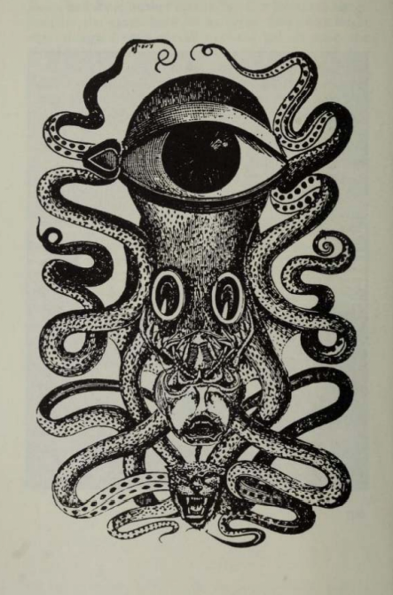

# stegano-image

Use steganography to hide strings in images.
This data does not get compressed when uploaded to social media platforms (tested with Twitter)

1. run steg.py, it will add the hardcoded string (in this case, EICAR) into image.png
2. upload it to twitter
3. download it elsewhere
4. run extract.py, you will see the hidden string that was initially added (remember to replace the hardcoded filename)

